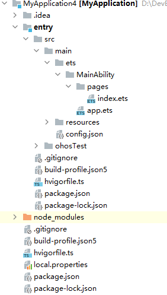

# Hello World

## 介绍

鸿蒙测试 Hello World

## 技术架构

## APP 包结构

Stage 模型和 FA 模型开发的应用，应用程序包结构并不相同

### Stage 模型

- Stage模型应用程序包结构如下图所示：

#### ArkTS 工程目录结构（API Version 8-9）

- AppScope > app.json5：应用的全局配置信息。
- entry：应用/服务模块，编译构建生成一个HAP。
- - oh_modules：用于存放三方库依赖信息。关于原npm工程适配OHPM包管理器操作，请参考[OHPM包管理器](https://developer.harmonyos.com/cn/docs/documentation/doc-guides-V3/project_overview-0000001053822398-V3#section167081936119)。
- - src > main > ets：用于存放ArkTS源码。
- - src > main > ets > entryability：应用/服务的入口。
- - src > main > ets > pages：应用/服务包含的页面。
- - src > main > resources：用于存放应用/服务所用到的资源文件，如图形、多媒体、字符串、布局文件等。关于资源文件的详细说明请参考[资源文件的分类](https://developer.harmonyos.com/cn/docs/documentation/doc-guides/resource-categories-and-access-0000001435940589)。 

| 资源目录         | 资源文件说明                                                                                                                                                                                                                                                     |
|--------------|------------------------------------------------------------------------------------------------------------------------------------------------------------------------------------------------------------------------------------------------------------|
| base>element | 包括字符串、整型数、颜色、样式等资源的json文件。每个资源均由json格式进行定义，例如：  boolean.json：布尔型   color.json：颜色   float.json：浮点型   intarray.json：整型数组   integer.json：整型   pattern.json：样式   plural.json：复数形式   strarray.json：字符串数组   string.json：字符串值 |
| base>media   | 多媒体文件，如图形、视频、音频等文件，支持的文件格式包括：.png、.gif、.mp3、.mp4等。                                                                                                                                                                                                         |
| rawfile      | 用于存储任意格式的原始资源文件。rawfile不会根据设备的状态去匹配不同的资源，需要指定文件路径和文件名进行引用。                                                                                                                                                                                                 |

- - src > main > module.json5：Stage模型模块配置文件，主要包含HAP的配置信息、应用在具体设备上的配置信息以及应用的全局配置信息。
- - entry > build-profile.json5：当前的模块信息、编译信息配置项，包括buildOption、targets配置等。
- - entry > hvigorfile.ts：模块级编译构建任务脚本。
- - entry >oh-package.json5：配置三方包声明文件的入口及包名。
- build-profile.json5：应用级配置信息，包括签名、产品配置等。
- hvigorfile.ts：应用级编译构建任务脚本。

在基于Stage模型开发的应用项目代码下，都存在一个app.json5及一个或多个module.json5这两种配置文件。

**app.json5** 主要包含以下内容：
- 应用的全局配置信息，包含应用的包名、开发厂商、版本号等基本信息。
- 特定设备类型的配置信息。

**module.json5** 主要包含以下内容：
- Module的基本配置信息，例如Module名称、类型、描述、支持的设备类型等基本信息。
- 应用组件信息，包含UIAbility组件和ExtensionAbility组件的描述信息。
- 应用运行过程中所需的权限信息。

### FA 模型

- FA模型应用程序包结构如下图所示：

#### ArkTS 工程目录结构（API Version 8-9）

API Version 8工程目录结构图：

API Version 9工程目录结构图：

- entry：应用/服务模块，编译构建生成一个HAP。
- - src > main > ets：用于存放ArkTS源码。
- - src > main > ets > MainAbility：应用/服务的入口。
- - src > main > ets > MainAbility > pages：MainAbility包含的页面。
- - src > main > ets > MainAbility > app.ets：承载Ability生命周期。
- - src > main > resources：用于存放应用/服务所用到的资源文件，如图形、多媒体、字符串、布局文件等。关于资源文件的详细说明请参考资源文件的分类。 

| 资源目录         | 资源文件说明                                                                                                                                                                                                                                                     |
|--------------|------------------------------------------------------------------------------------------------------------------------------------------------------------------------------------------------------------------------------------------------------------|
| base>element | 包括字符串、整型数、颜色、样式等资源的json文件。每个资源均由json格式进行定义，例如：  boolean.json：布尔型   color.json：颜色   float.json：浮点型   intarray.json：整型数组   integer.json：整型   pattern.json：样式   plural.json：复数形式   strarray.json：字符串数组   string.json：字符串值 |
| base>media   | 多媒体文件，如图形、视频、音频等文件，支持的文件格式包括：.png、.gif、.mp3、.mp4等。                                                                                                                                                                                                         |
| rawfile      | 用于存储任意格式的原始资源文件。rawfile不会根据设备的状态去匹配不同的资源，需要指定文件路径和文件名进行引用。                                                                                                                                                                                                 |

- - src > main > config.json：模块配置文件，主要包含HAP的配置信息、应用在具体设备上的配置信息以及应用的全局配置信息。
- - entry > build-profile.json5：当前的模块信息、编译信息配置项，包括buildOption、targets配置等。
- - entry > hvigorfile.ts：模块级编译构建任务脚本。
- build-profile.json5：应用级配置信息，包括签名、产品配置等。
- hvigorfile.ts：应用级编译构建任务脚本。

#### JS工程目录结构（FA模型

JS工程只支持FA模型，Hvigor工程支持API Version 8~9，其工程目录结构如下图所示：

- API Version 8工程目录结构图：

- API Version 9工程目录结构图：

- entry：应用/服务模块，编译构建生成一个HAP。
- - src > main > js：用于存放js源码。
- - src > main > js > MainAbility：应用/服务的入口。
- - src > main > js > MainAbility > i18n：用于配置不同语言场景资源内容，比如应用文本词条、图片路径等资源。
- - src > main > js > MainAbility > pages：MainAbility包含的页面。
- - src > main > js > MainAbility > app.js：承载Ability生命周期。
- - src > main > resources：用于存放应用/服务所用到的资源文件，如图形、多媒体、字符串、布局文件等。关于资源文件的详细说明请参考资源文件的分类。 

| 资源目录         | 资源文件说明                                                                                                                                                                                                                                                     |
|--------------|------------------------------------------------------------------------------------------------------------------------------------------------------------------------------------------------------------------------------------------------------------|
| base>element | 包括字符串、整型数、颜色、样式等资源的json文件。每个资源均由json格式进行定义，例如：  boolean.json：布尔型   color.json：颜色   float.json：浮点型   intarray.json：整型数组   integer.json：整型   pattern.json：样式   plural.json：复数形式   strarray.json：字符串数组   string.json：字符串值 |
| base>media   | 多媒体文件，如图形、视频、音频等文件，支持的文件格式包括：.png、.gif、.mp3、.mp4等。                                                                                                                                                                                                         |
| rawfile      | 用于存储任意格式的原始资源文件。rawfile不会根据设备的状态去匹配不同的资源，需要指定文件路径和文件名进行引用。                                                                                                                                                                                                 |

- - src > main > config.json：模块配置文件，主要包含HAP的配置信息、应用在具体设备上的配置信息以及应用的全局配置信息。
- - entry > build-profile.json5：当前的模块信息、编译信息配置项，包括buildOption、targets配置等。
- - entry > hvigorfile.ts：模块级编译构建任务脚本。
- build-profile.json5：应用级配置信息，包括签名、产品配置等。
- hvigorfile.ts：应用级编译构建任务脚本。

### 其他工程目录结构请查看

[其他工程目录结构请查看](https://developer.harmonyos.com/cn/docs/documentation/doc-guides-V3/project_overview-0000001053822398-V3#section3732132312179)

### oh-package.json5字段说明

| oh-package.json5包含字段 | 字段说明   | 说明                                                                          |
|----------------------|--------|-----------------------------------------------------------------------------|
| name                 | 软件包名称  | 必选字段，若package.json文件中未指明，需在oh-package.json5添加补齐                             |
| version              | 软件包版本  | 必选字段，若package.json文件中未指明，需在oh-package.json5添加补齐                             |
| description          | 软件包简介  | 必选字段，若package.json文件中未指明，需在oh-package.json5添加补齐                             |
| keywords             | 软件包关键字 | -                                                                           |
| homepage             | 主页链接   | -                                                                           |
| license              | 开源协议   | -                                                                           |
| author               | 软件包作者  | -                                                                           |
| main                 | 软件包入口  | -                                                                           |
| repository           | 仓库地址   | -                                                                           |
| dependencies         | 生产依赖   | 该字段处理方式请参阅下方说明内容                                                            |
| devDependencies      | 开发依赖   | -                                                                           |
| types                | 类型定义   | -                                                                           |
| artifactType         | 共享包类型  | 可选项：  original：源码，即发布源码(.ts/.ets)。  obfuscation：混淆代码，即源码经过混淆之后发布上传。 |

> **说明**
> - 工程的package.json文件的dependencies字段处理方式如下：
> - - @ohos/hypium：测试框架的依赖，迁移时需要放到oh-package.json5文件的devDependencies字段下；
> - - 删除@ohos/hvigor和@ohos/hvigor-ohos-plugin字段，无需迁移到oh-package.json5中；
> - - 其他依赖可直接复制到oh-package.json5的dependencies字段中。
> - 除表格中呈现的字段外，package.json中其余字段暂不支持迁移。如您在历史工程中使用到其余字段，请反馈您所使用的字段（选中文本，点击“意见反馈”）。

