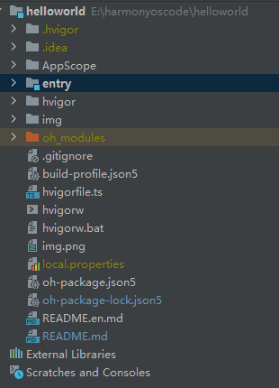
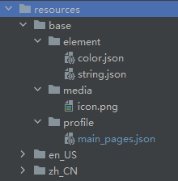

# Hello World

## 介绍

鸿蒙测试 Hello World

## 技术架构

## 创建项目(主要部分)

## 了解基本工程目录

### 工程级目录

其中详细如下：
- **AppScope** 中存放应用全局所需要的资源文件。
- **entry** 是应用的主模块，存放HarmonyOS应用的代码、资源等。
- **oh_modules** 是工程的依赖包，存放工程依赖的源文件。
- **build-profile.json5** 是工程级配置信息，包括签名、产品配置等。
- **hvigorfile.ts** 是工程级编译构建任务脚本，hvigor是基于任务管理机制实现的一款全新的自动化构建工具，主要提供任务注册编排，工程模型管理、配置管理等核心能力。
- **oh-package.json5** 是工程级依赖配置文件，用于记录引入包的配置信息。

在AppScope，其中有resources文件夹和配置文件app.json5。`AppScope>resources>base` 中包含element和media两个文件夹，

- **element** 文件夹主要存放公共的字符串、布局文件等资源。
- **media** 存放全局公共的多媒体资源文件。

### 模块级目录

entry>src目录中主要包含总的main文件夹，单元测试目录ohosTest，以及模块级的配置文件。

- **main** 文件夹中，ets文件夹用于存放ets代码，resources文件存放模块内的多媒体及布局文件等，module.json5文件为模块的配置文件。
- **ohosTest** 是单元测试目录。
- **build-profile.json5** 是模块级配置信息，包括编译构建配置项。
- **hvigorfile.ts** 文件是模块级构建脚本。
- **oh-package.json5** 是模块级依赖配置信息文件。
- **entryability** 存放ability文件，用于当前ability应用逻辑和生命周期管理。
- **pages** 存放UI界面相关代码文件，初始会生成一个Index页面。

resources目录下存放模块公共的多媒体、字符串及布局文件等资源，分别存放在element、media文件夹中。

### app.json5

其中配置信息如下：

- bundleName是包名。
- vendor是应用程序供应商。
- versionCode是用于区分应用版本。
- versionName是版本号。
- icon对应于应用的显示图标。
- label是应用名。

### module.json5

`entry>src>main>module.json5` 是模块的配置文件，包含当前模块的配置信息。

其中module对应的是模块的配置信息，一个模块对应一个打包后的hap包，hap包全称是HarmonyOS Ability Package，其中包含了ability、第三方库、资源和配置文件。其具体属性及其描述可以参照下表1。

**表1 module.json5默认配置属性及描述**

| 属性                  | 描述                                                                                  |
|:--------------------|:------------------------------------------------------------------------------------|
| name                | 该标签标识当前module的名字，module打包成hap后，表示hap的名称，标签值采用字符串表示（最大长度31个字节），该名称在整个应用要唯一。          |
| type                | 表示模块的类型，类型有三种，分别是entry、feature和har。                                                 |
| srcEntry            | 当前模块的入口文件路径。                                                                        |
| description         | 当前模块的描述信息。                                                                          |
| mainElement         | 该标签标识hap的入口ability名称或者extension名称。只有配置为mainElement的ability或者extension才允许在服务中心露出。    |
| deviceTypes         | 该标签标识hap可以运行在哪类设备上，标签值采用字符串数组的表示。                                                   |
| deliveryWithInstall | 标识当前Module是否在用户主动安装的时候安装，表示该Module对应的HAP是否跟随应用一起安装。- true：主动安装时安装。- false：主动安装时不安装。 |
| installationFree    | 标识当前Module是否支持免安装特性。- true：表示支持免安装特性，且符合免安装约束。- false：表示不支持免安装特性。                   |
| pages               | 对应的是main_pages.json文件，用于配置ability中用到的page信息。                                        |
| abilities           | 是一个数组，存放当前模块中所有的ability元能力的配置信息，其中可以有多个ability。                                     |

**表2 abilities中对象的默认配置属性及描述**

| 属性                    | 描述                                                                                    |
|:----------------------|:--------------------------------------------------------------------------------------|
| name                  | 该标签标识当前ability的逻辑名，该名称在整个应用要唯一，标签值采用字符串表示（最大长度127个字节）。                                |
| srcEntry              | ability的入口代码路径。                                                                       |
| description           | ability的描述信息。                                                                         |
| icon                  | ability的图标。该标签标识ability图标，标签值为资源文件的索引。该标签可缺省，缺省值为空。如果ability被配置为MainElement，该标签必须配置。  |
| label                 | ability的标签名。                                                                          |
| startWindowIcon       | 启动页面的图标。                                                                              |
| startWindowBackground | 启动页面的背景色。                                                                             |
| visible               | ability是否可以被其他应用程序调用，true表示可以被其它应用调用， false表示不可以被其它应用调用。                              |
| skills                | 标识能够接收的意图的action值的集合，取值通常为系统预定义的action值，也允许自定义。                                       |
| entities              | 标识能够接收的Want的Action值的集合，取值通常为系统预定义的action值，也允许自定义。                                     |
| actions               | 标识能够接收Want的Entity值的集合。                                                                |

### main_pages.json

`src/main/resources/base/profile/main_pages.json`文件保存的是页面page的路径配置信息，所有需要进行路由跳转的page页面都要在这里进行配置。

## APP 包结构

Stage 模型和 FA 模型开发的应用，应用程序包结构并不相同

Entry.hap 相当于window的 `.exe` 文件

FeatureX.hap 相当于window的 `.dll` 文件

### Stage 模型

- Stage模型应用程序包结构如下图所示：

#### ArkTS 工程目录结构（API Version 8-9）

- AppScope > app.json5：是应用的全局的配置文件，用于存放应用公共的配置信息。

其中配置信息如下：

- - bundleName是包名。
- - vendor是应用程序供应商。
- - versionCode是用于区分应用版本。
- - versionName是版本号。
- - icon对应于应用的显示图标。
- - label是应用名。
- entry：应用/服务模块，编译构建生成一个HAP。
- - oh_modules：用于存放三方库依赖信息。关于原npm工程适配OHPM包管理器操作，请参考[OHPM包管理器](https://developer.harmonyos.com/cn/docs/documentation/doc-guides-V3/project_overview-0000001053822398-V3#section167081936119)。
- - src > main > ets：用于存放ArkTS源码。
- - src > main > ets > entryability：应用/服务的入口。
- - src > main > ets > pages：应用/服务包含的页面。
- - src > main > resources：用于存放应用/服务所用到的资源文件，如图形、多媒体、字符串、布局文件等。关于资源文件的详细说明请参考[资源文件的分类](https://developer.harmonyos.com/cn/docs/documentation/doc-guides/resource-categories-and-access-0000001435940589)。 

| 资源目录         | 资源文件说明                                                                                                                                                                                                                                                     |
|--------------|------------------------------------------------------------------------------------------------------------------------------------------------------------------------------------------------------------------------------------------------------------|
| base>element | 包括字符串、整型数、颜色、样式等资源的json文件。每个资源均由json格式进行定义，例如：  boolean.json：布尔型   color.json：颜色   float.json：浮点型   intarray.json：整型数组   integer.json：整型   pattern.json：样式   plural.json：复数形式   strarray.json：字符串数组   string.json：字符串值 |
| base>media   | 多媒体文件，如图形、视频、音频等文件，支持的文件格式包括：.png、.gif、.mp3、.mp4等。                                                                                                                                                                                                         |
| rawfile      | 用于存储任意格式的原始资源文件。rawfile不会根据设备的状态去匹配不同的资源，需要指定文件路径和文件名进行引用。                                                                                                                                                                                                 |

- - src > main > module.json5：Stage模型模块配置文件，主要包含HAP的配置信息、应用在具体设备上的配置信息以及应用的全局配置信息。
- - entry > build-profile.json5：当前的模块信息、编译信息配置项，包括buildOption、targets配置等。
- - entry > hvigorfile.ts：模块级编译构建任务脚本。
- - entry >oh-package.json5：配置三方包声明文件的入口及包名。
- build-profile.json5：应用级配置信息，包括签名、产品配置等。
- hvigorfile.ts：应用级编译构建任务脚本。

在基于Stage模型开发的应用项目代码下，都存在一个app.json5及一个或多个module.json5这两种配置文件。

**app.json5** 主要包含以下内容：
- 应用的全局配置信息，包含应用的包名、开发厂商、版本号等基本信息。
- 特定设备类型的配置信息。

**module.json5** 主要包含以下内容：
- Module的基本配置信息，例如Module名称、类型、描述、支持的设备类型等基本信息。
- 应用组件信息，包含UIAbility组件和ExtensionAbility组件的描述信息。
- 应用运行过程中所需的权限信息。

### FA 模型

- FA模型应用程序包结构如下图所示：

#### ArkTS 工程目录结构（API Version 8-9）

API Version 8工程目录结构图：

API Version 9工程目录结构图：

- entry：应用/服务模块，编译构建生成一个HAP。
- - src > main > ets：用于存放ArkTS源码。
- - src > main > ets > MainAbility：应用/服务的入口。
- - src > main > ets > MainAbility > pages：MainAbility包含的页面。
- - src > main > ets > MainAbility > app.ets：承载Ability生命周期。
- - src > main > resources：用于存放应用/服务所用到的资源文件，如图形、多媒体、字符串、布局文件等。关于资源文件的详细说明请参考资源文件的分类。 

| 资源目录         | 资源文件说明                                                                                                                                                                                                                                                     |
|--------------|------------------------------------------------------------------------------------------------------------------------------------------------------------------------------------------------------------------------------------------------------------|
| base>element | 包括字符串、整型数、颜色、样式等资源的json文件。每个资源均由json格式进行定义，例如：  boolean.json：布尔型   color.json：颜色   float.json：浮点型   intarray.json：整型数组   integer.json：整型   pattern.json：样式   plural.json：复数形式   strarray.json：字符串数组   string.json：字符串值 |
| base>media   | 多媒体文件，如图形、视频、音频等文件，支持的文件格式包括：.png、.gif、.mp3、.mp4等。                                                                                                                                                                                                         |
| rawfile      | 用于存储任意格式的原始资源文件。rawfile不会根据设备的状态去匹配不同的资源，需要指定文件路径和文件名进行引用。                                                                                                                                                                                                 |

- - src > main > config.json：模块配置文件，主要包含HAP的配置信息、应用在具体设备上的配置信息以及应用的全局配置信息。
- - entry > build-profile.json5：当前的模块信息、编译信息配置项，包括buildOption、targets配置等。
- - entry > hvigorfile.ts：模块级编译构建任务脚本。
- build-profile.json5：应用级配置信息，包括签名、产品配置等。
- hvigorfile.ts：应用级编译构建任务脚本。

#### JS工程目录结构（FA模型

JS工程只支持FA模型，Hvigor工程支持API Version 8~9，其工程目录结构如下图所示：

- API Version 8工程目录结构图：

- API Version 9工程目录结构图：

- entry：应用/服务模块，编译构建生成一个HAP。
- - src > main > js：用于存放js源码。
- - src > main > js > MainAbility：应用/服务的入口。
- - src > main > js > MainAbility > i18n：用于配置不同语言场景资源内容，比如应用文本词条、图片路径等资源。
- - src > main > js > MainAbility > pages：MainAbility包含的页面。
- - src > main > js > MainAbility > app.js：承载Ability生命周期。
- - src > main > resources：用于存放应用/服务所用到的资源文件，如图形、多媒体、字符串、布局文件等。关于资源文件的详细说明请参考资源文件的分类。 

| 资源目录         | 资源文件说明                                                                                                                                                                                                                                                     |
|--------------|------------------------------------------------------------------------------------------------------------------------------------------------------------------------------------------------------------------------------------------------------------|
| base>element | 包括字符串、整型数、颜色、样式等资源的json文件。每个资源均由json格式进行定义，例如：  boolean.json：布尔型   color.json：颜色   float.json：浮点型   intarray.json：整型数组   integer.json：整型   pattern.json：样式   plural.json：复数形式   strarray.json：字符串数组   string.json：字符串值 |
| base>media   | 多媒体文件，如图形、视频、音频等文件，支持的文件格式包括：.png、.gif、.mp3、.mp4等。                                                                                                                                                                                                         |
| rawfile      | 用于存储任意格式的原始资源文件。rawfile不会根据设备的状态去匹配不同的资源，需要指定文件路径和文件名进行引用。                                                                                                                                                                                                 |

- - src > main > config.json：模块配置文件，主要包含HAP的配置信息、应用在具体设备上的配置信息以及应用的全局配置信息。
- - entry > build-profile.json5：当前的模块信息、编译信息配置项，包括buildOption、targets配置等。
- - entry > hvigorfile.ts：模块级编译构建任务脚本。
- build-profile.json5：应用级配置信息，包括签名、产品配置等。
- hvigorfile.ts：应用级编译构建任务脚本。

### 其他工程目录结构请查看

[其他工程目录结构请查看](https://developer.harmonyos.com/cn/docs/documentation/doc-guides-V3/project_overview-0000001053822398-V3#section3732132312179)

### oh-package.json5字段说明

| oh-package.json5包含字段 | 字段说明   | 说明                                                                          |
|----------------------|--------|-----------------------------------------------------------------------------|
| name                 | 软件包名称  | 必选字段，若package.json文件中未指明，需在oh-package.json5添加补齐                             |
| version              | 软件包版本  | 必选字段，若package.json文件中未指明，需在oh-package.json5添加补齐                             |
| description          | 软件包简介  | 必选字段，若package.json文件中未指明，需在oh-package.json5添加补齐                             |
| keywords             | 软件包关键字 | -                                                                           |
| homepage             | 主页链接   | -                                                                           |
| license              | 开源协议   | -                                                                           |
| author               | 软件包作者  | -                                                                           |
| main                 | 软件包入口  | -                                                                           |
| repository           | 仓库地址   | -                                                                           |
| dependencies         | 生产依赖   | 该字段处理方式请参阅下方说明内容                                                            |
| devDependencies      | 开发依赖   | -                                                                           |
| types                | 类型定义   | -                                                                           |
| artifactType         | 共享包类型  | 可选项：  original：源码，即发布源码(.ts/.ets)。  obfuscation：混淆代码，即源码经过混淆之后发布上传。 |

> **说明**
> - 工程的package.json文件的dependencies字段处理方式如下：
> - - @ohos/hypium：测试框架的依赖，迁移时需要放到oh-package.json5文件的devDependencies字段下；
> - - 删除@ohos/hvigor和@ohos/hvigor-ohos-plugin字段，无需迁移到oh-package.json5中；
> - - 其他依赖可直接复制到oh-package.json5的dependencies字段中。
> - 除表格中呈现的字段外，package.json中其余字段暂不支持迁移。如您在历史工程中使用到其余字段，请反馈您所使用的字段（选中文本，点击“意见反馈”）。

