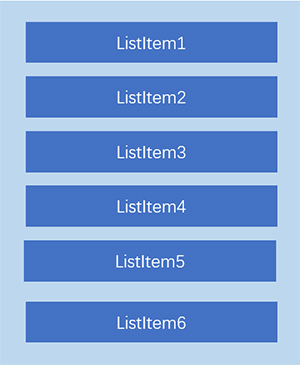
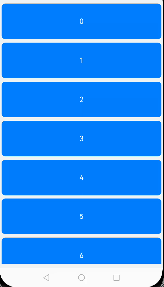
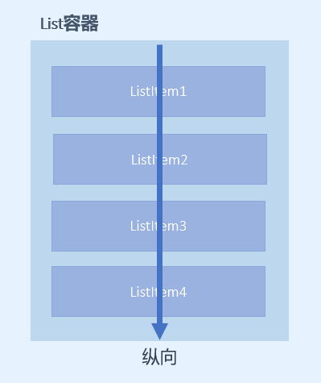
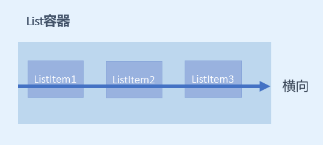
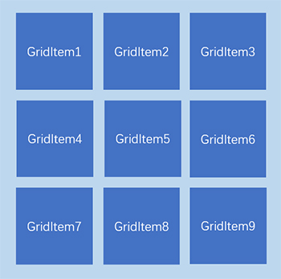
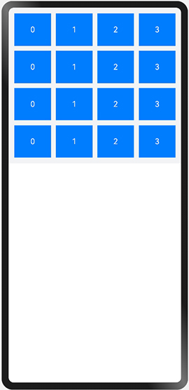

# 容器组件与布局

## 相关概念

基础组件：
- Text：显示一段文本的组件。
- Image：图片组件，支持本地图片和网络图片的渲染展示。
- TextInput：可以输入单行文本并支持响应输入事件的组件。
- Button：按钮组件，可快速创建不同样式的按钮。
- LoadingProgress：用于显示加载动效的组件。

容器组件：
- Flex：应用弹性方式布局子组件的容器组件。
- Column：沿垂直方向布局的容器。
- Row：沿水平方向布局容器。
- List：列表包含一系列相同宽度的列表项。适合连续、多行呈现同类数据，例如图片和文本。
- Swiper：滑动容器，提供切换子组件显示的能力。
- Grid：网格容器，由“行”和“列”分割的单元格所组成，通过指定“项目”所在的单元格做出各种各样的布局。

## Column和Row

- Column 列，沿垂直方向布局的容器。
- Row 行，沿水平方向布局的容器。

----------------------------------------------------

----------------------------------------------------

主轴和交叉轴概念：

> 一个垂直，一个水平；以一个为主轴时，另一个就是交叉轴。

属性介绍：

- justifyContent：设置子组件在主轴方向上的对齐格式。

子组件在主轴方向上的对齐使用justifyContent属性来设置，其参数类型是FlexAlign。`FlexAlign` 定义了以下几种类型：

- - **Start**：元素在主轴方向首端对齐，第一个元素与行首对齐，同时后续的元素与前一个对齐（简单理解：首部对齐）。
- - **Center**：元素在主轴方向中心对齐（简单理解：居中对齐）。
- - **End**：元素在主轴方向尾部对齐（简单理解：尾部对齐）。
- - **SpaceBetween**：元素在主轴方向均匀分配弹性元素，相邻元素之间距离相同。 第一个元素与行首对齐，最后一个元素与行尾对齐。
- - **SpaceAround**：元素在主轴方向均匀分配弹性元素，相邻元素之间距离相同。 第一个元素到行首的距离和最后一个元素到行尾的距离是相邻元素之间距离的一半。
- - **SpaceEvenly**：元素在主轴方向等间距布局，无论是相邻元素还是边界元素到容器的间距都一样。

----------------------------

- alignItems：设置子组件在交叉轴方向上的对齐格式。

-Column容器的主轴是垂直方向，交叉轴是水平方向，其参数类型为HorizontalAlign（水平对齐），`HorizontalAlign` 定义了以下几种类型：

- - **Start**：设置子组件在水平方向上按照起始端对齐。
- - **Center**（默认值）：设置子组件在水平方向上居中对齐。
- - **End**：设置子组件在水平方向上按照末端对齐。

----------------------------

-Row容器的主轴是水平方向，交叉轴是垂直方向，其参数类型为VerticalAlign（垂直对齐），`VerticalAlign` 定义了以下几种类型：

- - **Top**：设置子组件在垂直方向上居顶部对齐。
- - **Center**（默认值）：设置子组件在竖直方向上居中对齐。
- - **Bottom**：设置子组件在竖直方向上居底部对齐。

----------------------------------------------------

----------------------------------------------------

接口介绍：

- Column(value?:{space?: string | number})
- Row(value?:{space?: string | number})

Column和Row容器的接口都有一个可选参数space，表示子组件在主轴方向上的间距。


## 构建列表页面布局

常见的列表有线性列表（List列表）和网格布局（Grid列表）：


### List组件的使用

#### List组件简介

List是很常用的滚动类容器组件，一般和子组件`ListItem`一起使用，`List`列表中的每一个列表项对应一个`ListItem`组件。



#### 使用ForEach渲染列表

```tsx
@Entry
@Component
struct ListDemo {
  private arr: number[] = [0, 1, 2, 3, 4, 5, 6, 7, 8, 9]

  build() {
    Column() {
      List({ space: 10 }) {
        ForEach(this.arr, (item: number) => {
          ListItem() {
            Text(`${item}`)
              .width('100%')
              .height(100)
              .fontSize(20)
              .fontColor(Color.White)
              .textAlign(TextAlign.Center)
              .borderRadius(10)
              .backgroundColor(0x007DFF)
          }
        }, item => item)
      }
    }
    .padding(12)
    .height('100%')
    .backgroundColor(0xF1F3F5)
  }
}
```



#### 设置列表项分割线

List组件子组件ListItem之间默认是没有分割线的，部分场景子组件ListItem间需要设置分割线，
这时候您可以使用List组件的`divider`属性。divider属性包含四个参数：

- **strokeWidth**: 分割线的线宽。
- **color**: 分割线的颜色。
- **startMargin**：分割线距离列表侧边起始端的距离。
- **endMargin**: 分割线距离列表侧边结束端的距离。

```tsx
List(){ ... }.divider({ strokeWidth: '4', color: Color.Red, startMargin: '8', endMargin: '8' })
```


#### List列表滚动事件监听

List组件提供了一系列事件方法用来监听列表的滚动，您可以根据需要，监听这些事件来做一些操作：

- onScroll：列表滑动时触发，返回值scrollOffset为滑动偏移量，scrollState为当前滑动状态。
- onScrollIndex：列表滑动时触发，返回值分别为滑动起始位置索引值与滑动结束位置索引值。
- onReachStart：列表到达起始位置时触发。
- onReachEnd：列表到底末尾位置时触发。
- onScrollStop：列表滑动停止时触发。

```tsx
List({ space: 10 }) {
  ForEach(this.arr, (item) => {
    ListItem() {
      Text(`${item}`)
        ...
    }.editable(true)
  }, item => item)
}
.editMode(this.editFlag)
// 列表滑动时触发，返回值分别为 滑动起始位置索引值 与 滑动结束位置索引值。
.onScrollIndex((firstIndex: number, lastIndex: number) => {
    console.info('first：' + firstIndex + '，last：' + lastIndex)
})
// 列表滑动时触发，返回值scrollOffset为滑动偏移量，scrollState为当前滑动状态。
.onScroll((scrollOffset: number, scrollState: ScrollState) => {
    console.info('scrollOffset：' + scrollOffset + '，scrollState：' + scrollState)
})
// 滑动到顶部时
.onReachStart(() => {
    console.info('onReachStart')
})
// 滑动到底部时
.onReachEnd(() => {
    console.info('onReachEnd')
})
// 停止滑动时
.onScrollStop(() => {
    console.info('onScrollStop')
})
```

#### 设置List排列方向listDirection

List组件里面的列表项默认是按垂直方向排列的.

`listDirection` 属性设置为`Axis.`。

```tsx
List(){ ... }.listDirection(Axis.Vertical)
```



 `listDirection` 属性设置为`Axis.Horizontal`。

```tsx
List(){ ... }.listDirection(Axis.Horizontal)
```



### Grid组件的使用

#### Grid组件简介

Grid组件为网格容器，是一种网格列表，由“行”和“列”分割的单元格所组成，通过指定“项目”所在的单元格做出各种各样的布局。Grid组件一般和子组件GridItem一起使用，Grid列表中的每一个条目对应一个GridItem组件。



#### 使用ForEach渲染网格布局

和List组件一样，Grid组件也可以使用ForEach来渲染多个列表项GridItem，我们通过下面的这段示例代码来介绍Grid组件的使用。

```tsx
@Entry
@Component
struct GridExample {
  private arr: String[] = ['0', '1', '2', '3']

  build() {
    Column() {
      Grid() {
        ForEach(this.arr, (day: string) => {
          ForEach(this.arr, (day: string) => {
            GridItem() {
              Text(day)
                .fontSize(16)
                .fontColor(Color.White)
                .backgroundColor(0x007DFF)
                .width('100%')
                .height('100%')
                .textAlign(TextAlign.Center)
            }
          }, day => day)
        }, day => day)
      }
      .columnsTemplate('1fr 1fr 1fr 1fr')
      .rowsTemplate('1fr 1fr 1fr 1fr')
      .columnsGap(10)
      .rowsGap(10)
      .height(300)
    }
    .width('100%')
    .padding(12)
    .backgroundColor(0xF1F3F5)
  }
}
```

示例代码中使用了两层ForEach遍历长度为4的数组arr，创建了16个GridItem列表项。

- columnsTemplate：`1fr 1fr 1fr 1fr`，表示这个网格为4列，将Grid允许的宽分为4等分，每列占1份；
- rowsTemplate：`1fr 1fr 1fr 1fr`，表示这个网格为4行，将Grid允许的高分为4等分，每行占1份。
- columnsGap：列间距为10vp。
- rowsTemplate：行间距为10vp。

示例代码效果图如下：



上面构建的网格布局使用了固定的行数和列数，所以构建出的网格是不可滚动的。
然而有时候因为内容较多，我们通过滚动的方式来显示更多的内容，就需要一个可以滚动的网格布局。
我们只需要设置 rowsTemplate 和 columnsTemplate 中的一个即可。

将示例代码中 `GridItem` 的高度设置为固定值，例如100；仅设置 columnsTemplate 属性，不设置rowsTemplate属性，就可以实现Grid列表的滚动：

```tsx
Grid() {
  ForEach(this.arr, (day: string) => {
    ForEach(this.arr, (day: string) => {
      GridItem() {
        Text(day)
          .height(100)
          ...
      }
    }, day => day)
  }, day => day)
}
.columnsTemplate('1fr 1fr 1fr 1fr')
.columnsGap(10)
.rowsGap(10)
.height(300)
```

此外，Grid像List一样也可以使用onScrollIndex来监听列表的滚动。

#### 列表性能优化

开发者在使用长列表时，如果直接采用循环渲染方式，会一次性加载所有的列表元素，从而导致页面启动时间过长，影响用户体验，推荐通过以下方式来进行列表性能优化：

[使用数据懒加载](https://developer.harmonyos.com/cn/docs/documentation/doc-guides-V3/ui-ts-performance-improvement-recommendation-0000001477981001-V3#ZH-CN_TOPIC_0000001477981001__推荐使用数据懒加载)

[设置list组件的宽高](https://developer.harmonyos.com/cn/docs/documentation/doc-guides-V3/ui-ts-performance-improvement-recommendation-0000001477981001-V3#ZH-CN_TOPIC_0000001477981001__设置list组件的宽高)

#### 参考链接

1. List组件的相关API参考：[List组件](https://developer.harmonyos.com/cn/docs/documentation/doc-references-V3/ts-container-list-0000001477981213-V3?catalogVersion=V3)。
2. Grid组件的相关API参考：[Grid组件](https://developer.harmonyos.com/cn/docs/documentation/doc-references-V3/ts-container-grid-0000001478341161-V3?catalogVersion=V3)。
3. 循环渲染（ForEach）：[循环渲染](https://developer.harmonyos.com/cn/docs/documentation/doc-guides-V3/arkts-rendering-control-0000001427744548-V3?catalogVersion=V3#ZH-CN_TOPIC_0000001427744548__循环渲染)。


